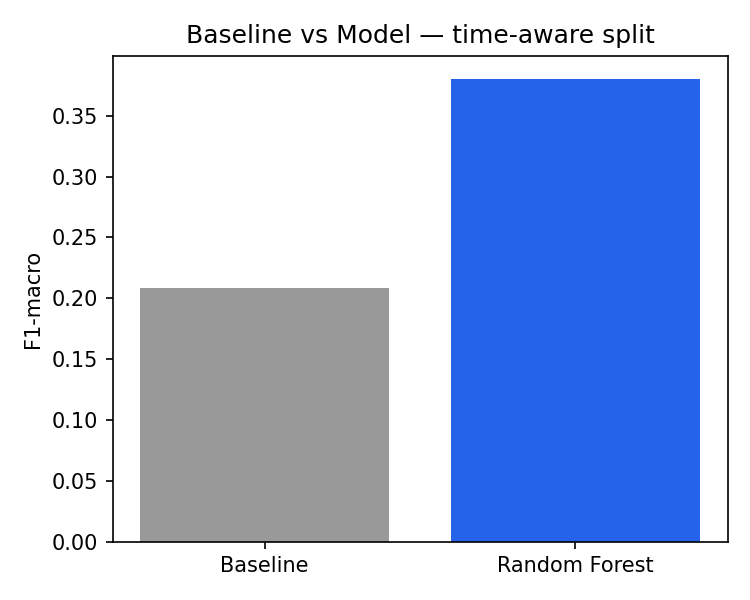

# Refresh & Content Opportunity Scoring: A Time-Aware Classifier for Search Content Health

## Abstract

Which published content needs attention this week, and why? This capstone builds a
time-aware classifier that scores content items as *growing*, *declining*, or
*worth review* based on 28-day trends in search position, clicks, and click-through
rate. Using a single client's search performance history, a Random Forest model
was validated against a strictly time-aware train/test split with explicit leakage
checks. The model reached an F1-macro score of 0.380 against a blind majority-class
baseline of 0.208 — roughly an 83% relative improvement — with position volatility
and mean position emerging as the dominant predictive signals. The result is best
read as a directional prioritization signal for a content team's review queue,
not a precise or causal forecast.

---

## Introduction / Problem Statement

Content teams managing large catalogs of published pages face a recurring
question: which pages are actually worth someone's time this week? Manually
reviewing every page's search performance doesn't scale once a catalog grows
past a few hundred items, and simple heuristics (like "sort by clicks") miss
pages that are quietly declining before the drop becomes obvious, or pages
that are already recovering on their own and don't need intervention.

This project frames that as a classification problem: given a page's recent
search behavior, predict whether it's growing, declining, or needs manual
review — and rank the output by model confidence so a content team can work
top-down through a prioritized list instead of an alphabetical one. The
decision this supports is **triage**: where a limited content review budget
should go first, each week, ranked by model confidence instead of alphabetical
order or raw click count.

---

## Data

**Release:** FlyRank Internship Pseudonymized Warehouse, version `v20260703`
(frozen snapshot, export date 2026-07-03).

**Tables used:** `fact_content_daily_performance`, `dim_content`, and
`dim_clients` (used only for client selection, not as model features).

**Scope:** a single pseudonymized client — the one with the longest continuous
Search Console data availability in the release — to keep the trend signal
internally consistent and avoid mixing performance dynamics across clients
with very different baselines and traffic scales.

**Date windows:** two independent 28-day feature windows, each paired with
its own following 28-day label window. The two train/test blocks are
sequential and non-overlapping in time.

**Exclusions:**
- Rows where `gsc_data_available = false`.
- Content items with fewer than 5 observed days in a given window.
- Content items with fewer than 50 total impressions in a window.
- Unpublished content (`is_published = false`).

**Privacy:** no client names, domains, URLs, raw exports, or query-level
detail appear anywhere in this paper. Pseudonymous IDs are used only for
joining and grouping records, never as model features.

---

## Methodology

**Label definition.** For each content item, the normalized 28-day click
slope (linear trend, scaled by the window's mean clicks) was thresholded
into:
- **growing** — relative click slope > +0.02
- **declining** — relative click slope < −0.02
- **review** — everything else, including high-volatility and missing-trend
  cases

*A planned fourth "recovering" class produced zero training examples at a
workable threshold and was folded into "review" — a limitation of the
labeling scheme, not of the underlying data.*

**Features:** `avg_position_mean`, `avg_position_slope`,
`avg_position_volatility`, `clicks_mean`, `clicks_slope`, `ctr_mean`,
`ctr_slope`, `impressions_total`, `page_age_days`, `search_volume`,
`word_count`, `competition`, `backlinks`.

`clicks_slope` is included as a feature, computed entirely within the
**feature window**. It never overlaps the separate, later **label window**
used to compute the click slope that defines the label itself — the two
values are the same *kind* of measurement but calculated on strictly
non-overlapping date ranges. That temporal separation, not exclusion of the
feature, is what prevents leakage. Client and content IDs are used only as
grouping/join keys and are never passed to the model as features.

**Baseline.** A naive majority-class rule: the most common label in the
*training* set ("review") predicted for every test item, blind to test
labels. (An earlier draft of this pipeline computed the baseline from the
test set's own label distribution, which is circular; that was corrected
before reporting the numbers below.)

**Model.** Random Forest, 300 trees, max depth 8, class-weighted,
`random_state=42`.

**Validation design — time-aware split.** Two sequential, non-overlapping
time blocks: a train block (28-day feature window + its own 28-day label
window), followed by a test block whose feature window begins only *after*
the train block's label window ends. This was deliberately chosen over a
random shuffle/K-fold split, which would let the model see future-window
information during training and inflate the reported score.

**Leakage checks.** Feature windows never overlap their own or any later
label window. The label's underlying click slope is computed on a date range
disjoint from every feature's date range. Client and content IDs are never
passed as model features.

---

## Results

| Split | Metric | Score |
|---|---|---|
| Baseline (train majority class, blind) | F1-macro | 0.208 |
| Random Forest | F1-macro | **0.380** |
| Random Forest | Accuracy | 0.417 |

Relative improvement over baseline: **~83%**.

**Per-class breakdown (Random Forest, test set):**

| Class | Precision | Recall | F1 | Support |
|---|---|---|---|---|
| declining | 0.31 | 0.15 | 0.20 | 747 |
| growing | 0.34 | 0.65 | 0.45 | 834 |
| review | 0.60 | 0.42 | 0.49 | 1314 |

**Feature importance:** `avg_position_mean` and `avg_position_volatility`
dominate by a wide margin. CTR trend and static content attributes (search
volume, word count, competition, backlinks) contribute only secondary
signal.

---

## Limitations & Honest Framing

- **Directional signal, not a precise or causal forecast.** F1-macro of
  0.380 means meaningfully better than guessing, not highly accurate.
- **Declining pages are hardest to catch:** recall of 0.15 means most true
  declines are missed by this model.
- **Growing pages are over-flagged:** precision of 0.34 means roughly
  two-thirds of "growing" flags are wrong.
- **Single-client scope.** Results reflect one client's traffic dynamics and
  are not claimed to generalize to other clients without re-validation.
- **No causal claims.** All findings are correlational and say nothing about
  Google's ranking algorithm or why any individual page's performance
  changed.
- **The "recovering" label was dropped** — too few examples to model
  reliably at the chosen threshold, a labeling-scheme limitation rather than
  evidence that recovery patterns don't exist in the data.
- **No interaction effects tested** (e.g., whether static content attributes
  matter more for low-volatility pages specifically) — flagged as a future
  extension, not attempted here.

---

## Ranked Recommendations

1. **Use model output to prioritize, not replace, manual review.** Start
   with `review`-flagged items — the strongest-precision class (0.60).
2. **Pair the model with a simple rule-based safety net for declines**,
   given recall of only 0.15 on the `declining` class.
3. **Treat `growing` flags as a shortlist to verify, not a guarantee**
   (precision 0.34).
4. **Prioritize position volatility and mean position as first-class
   signals** in any future iteration — they dominated feature importance
   here, well ahead of content attributes like word count or search volume.
5. **Re-validate on any new client's own data before extending** — these
   exact thresholds reflect a single client's traffic scale and content
   strategy only.

---

## Reproducibility

- **Repository:** [github.com/Yashcodes07/flyrank-ml-internship](https://github.com/Yashcodes07/flyrank-ml-internship)
- **Capstone pipeline:** `work/notebooks/w07_action_playbook.ipynb` — full
  pipeline from raw warehouse data through feature engineering, time-aware
  split, model training, and the ranked action report.
- **Validation audit:** `work/notebooks/w06_validation_audit.ipynb` —
  before/after honest-split comparison and leakage audit.
- **Exported artifacts** (`work/outputs/`):
  - `ranked_action_queue.csv` — the ranked, confidence-sorted action list
  - `baseline_vs_model.png` — the chart above
  - `retrain_baseline.json` — snapshot for detecting future model drift
  - `playbook_summary.txt` — human-readable action playbook summary
- **Metrics file** (`work/results/test_metrics.json`) — baseline and model
  F1-macro, accuracy, and full per-class precision/recall/F1/support,
  committed to the repo so results are checkable directly from a file rather
  than only from notebook output.
- **Submission pointer:** `submission/paper_url.txt` in the repository above
  contains the live URL of this deployed paper.

---

## Acknowledgments & Data Credit

Built on the FlyRank ML Internship dataset —
[flyrank.ai](https://flyrank.ai).
